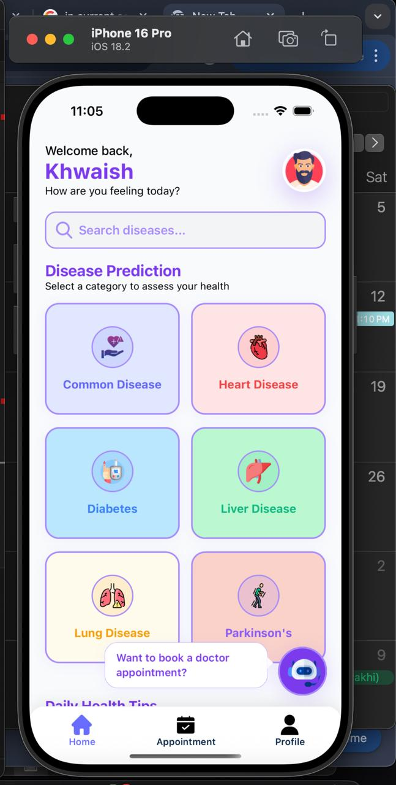
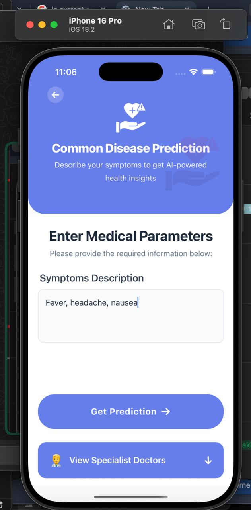
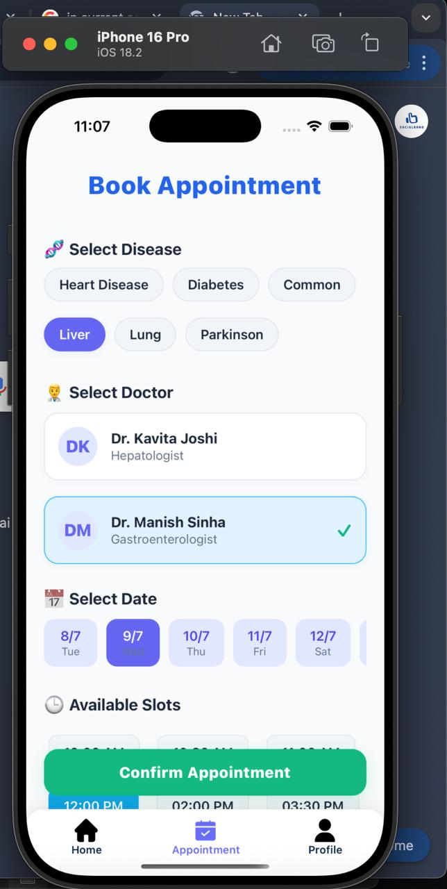
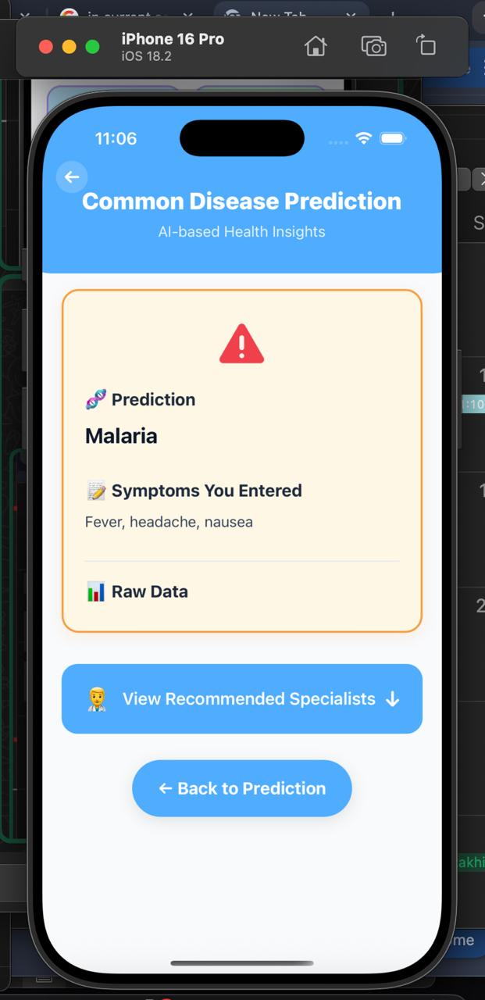
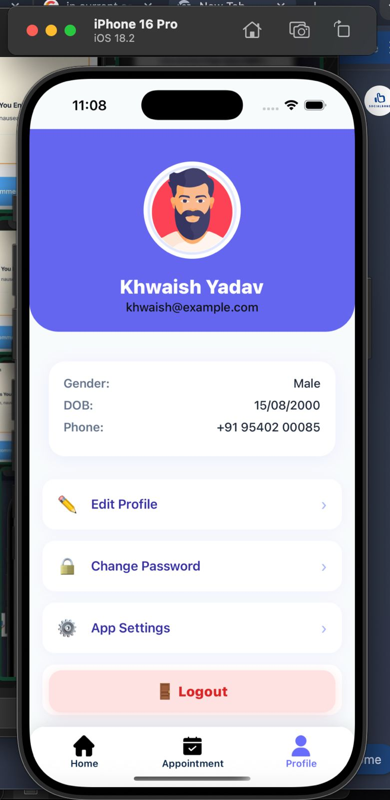
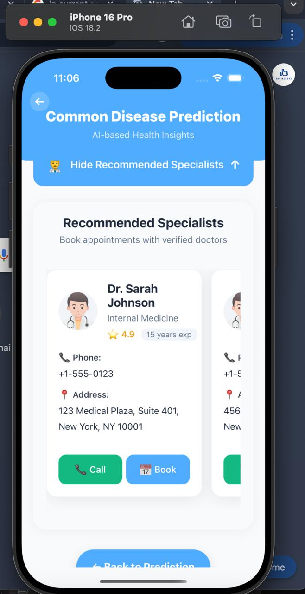

# 🧠💡 MediGuide – Your AI-Powered Personal Health Companion

MediGuide is a revolutionary healthcare app that brings together the power of AI-based disease prediction, intelligent symptom analysis, and instant doctor appointment booking — all in one easy-to-use platform. It’s designed to make healthcare more accessible, proactive, and personalized for everyone.


## 📽️ Demo Video

🎬 [Click to Watch the Demo](https://drive.google.com/file/d/1W4khkqilvQFg58eGDDLM0P9rhx5bZ7k5/view?usp=drivesdk)

## ✨ Features

- 🩺 **Advanced Disease Prediction**
  - Predicts:
    - ✅ Heart Disease
    - ✅ Diabetes
    - ✅ Liver Disease
    - ✅ Lung Cancer
    - ✅ Parkinson’s
    - ✅ Common Diseases (symptom-based)
  - Uses ML models trained on real medical datasets  
  - Detects **over 1,082 diseases**

- 🤖 **24/7 Intelligent Medical Chatbot**
  - Understands your symptoms
  - Provides real-time health insights
  - Always available for advice

- 📅 **Instant Doctor Appointment Booking**
  - Connects users to doctors based on predictions
  - Fast, relevant scheduling  
  - All in one smooth flow

- 📱 **Beautiful React Native UI**
  - Gradient cards
  - Smooth animations
  - Clean mobile-first design

- 🔄 **Real-time backend API Integration**

## 🌟 Why MediGuide is Unique

- Combines **AI prediction**, **symptom checker**, and **doctor booking**
- Detects over **1,082 diseases**
- Bridges the gap between self-assessment and professional care
- Simple, secure, intuitive interface
- Helps catch illnesses early for faster, better outcomes  
- Like having a medical expert in your pocket 📱


## 🧠 Backend Setup (Flask + ML)

The backend is built using Flask and serves ML models as REST APIs.

### ▶️ Run the Backend

```bash
cd Backend
python3 -m venv venv
source venv/bin/activate     # On Windows: venv\Scripts\activate
pip install -r requirements.txt
python app.py
```

##📱 Frontend Setup (React Native)

-The frontend uses React Native with animated screens, chatbot integration, and seamless API calls to the backend.

-🛠 Installation
-From the root directory:

```bash
npm install   # or yarn install
```

## ▶️ Run the App
-For Android:

```bash
npx react-native run-android
```


-Make sure Android emulator is running or your device is connected.
-For iOS (Mac Only):

```bash
npx pod-install ios
npx react-native run-ios
```
## 📱 App Screens — Preview

Take a quick look at the key screens of the MediGuide mobile app:

| 🏠 Home Screen | 📊 Disease Prediction | 💬 ChatBot | 📅 Appointment

|:----------------|:------------------------|:-----------|
|  |  |  |  |    |  |  | 

